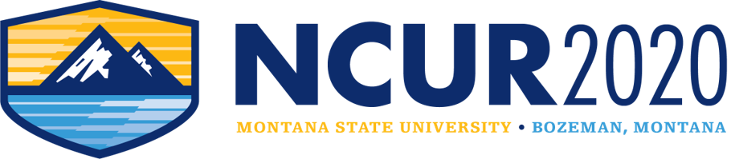

### **Extra Credit**
{:.text-center}

### Participate in NCUR 2020
{:.text-center}

###### ***Assignment Due:*** *December 6, 2019   (Hard Deadline. No Exceptions.)*
{:.text-center}

## Objective

Submit an abstract to NCUR 2020!

From the _NCUR 2020 For Faculty_ webpage:
> NCUR 2020 offers an exciting opportunity for your students to present their research and creative projects to a national audience.
  Student presentations can be based on independent research projects or class-based research.
  The abstract deadline - **December 6, 2019** - is approaching...   
>  Abstracts describing projects in-progress are welcome. Registration fees for all MSU-Bozeman students will be paid in full through generous funding form the Provost. Visit the NCUR 2020 conference web site for information about the conference, abstract guidelines, and access to the abstract and registration portal.  

Please see the [NCUR 2020 Abstract Guidelines](http://www.cur.org/what/events/students/ncur/2020/ncur_2020_abstract_guidelines/) for more details.

## What To Turn In & Instructions On Submitting your Assignment

Please submit **a single PDF** containing your abstract accompanied with proof of your submission
_(e.g., a confirmation receipt that you should receive upon submitting your abstract through the NCUR portal.)_ 

<!--
## Rubric

...
-->
